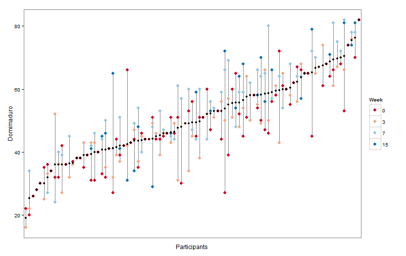
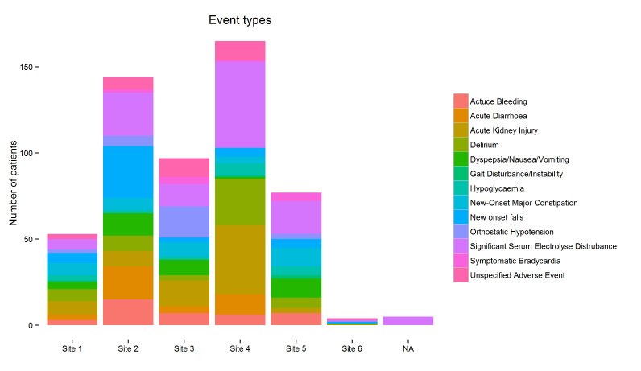
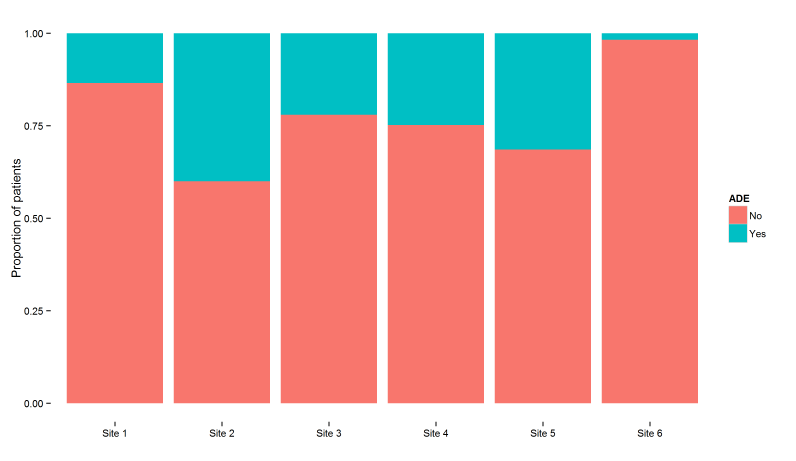
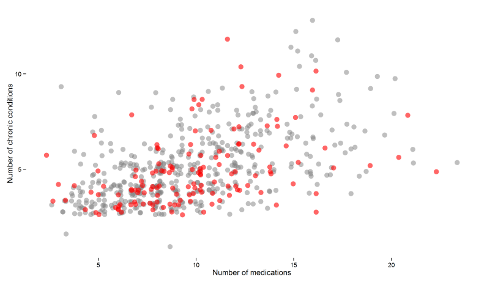
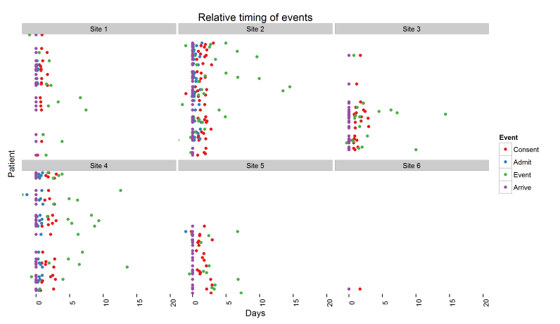

<br>
<br>
<center></center>
<br>
<br>

---

<br>
<br>
<center></center>
<br>
<br>

---

<br>
<br>
<center></center>
<br>
<br>

---

<br>
<br>
<center></center>
<br>
<br>

---

<br>
<br>
<center></center>
<br>
<br>

---

<br>
<br>
<center></center>
<br>
<br>

---

<br>
<br>
<center></center>
<br>
<br>

---

<br>
<br>
<center></center>
<br>
<br>

---

<br>
<br>
<center></center>
<br>
<br>

---

<br>
<br>
<center></center>
<br>
<br>

---

<br>
<br>
<center></center>
<br>
<br>

---

<br>
<br>
<center></center>
<br>
<br>

---

<br>
<br>
<center></center>
<br>
<br>

---

## ggplot2 works with data frames

```{r data, echo = TRUE, include = TRUE, warning = FALSE, message = FALSE} 

   library(ggplot2)
   head(iris)
   
```  

---

## Object class matters

```{r class, echo = TRUE, warning = FALSE, message = FALSE} 

   lapply(iris, class)
   
```  

---

## Minimal example


```{r minimal code, echo = TRUE, warning = FALSE, message = FALSE, fig.show = 'hide'} 

   ggplot(iris, aes(x = Sepal.Width)) +
   geom_bar()  

```   


---


```{r first plot, echo = FALSE, warning = FALSE, message = FALSE, fig.width = 12, fig.height = 8, fig.align = 'center'} 

   ggplot(iris, aes(x = Sepal.Width)) +
   geom_bar()  
   
``` 

---

```{r as object 1, echo = TRUE, warning = FALSE, message = FALSE} 

   plot <- ggplot(iris, aes(x = Sepal.Width)) 
   plot <- plot + geom_bar()  

```   

---

```{r as object 2, echo = TRUE, warning = FALSE, message = FALSE, fig.align = 'center'} 

   plot

```   

---

## Data

```{r index data, echo = TRUE, warning = FALSE, message = FALSE, fig.width = 7, fig.height = 5, fig.align = 'center'} 

   ggplot(iris[1:10, ], aes(x = Sepal.Width)) +
   geom_bar()  

```   

---

```{r subset data, echo = TRUE, warning = FALSE, message = FALSE, fig.width = 7, fig.height = 5, fig.align = 'center'} 

   ggplot(subset(iris, Species == "setosa"), aes(x = Sepal.Width)) +
   geom_bar()  

``` 

---

```{r pipe data, echo = TRUE, warning = FALSE, message = FALSE, fig.width = 7, fig.height = 5, fig.align = 'center'} 

   library(dplyr)
   
   iris %>%
   filter(Species == "virginica") %>%

   ggplot(aes(x = Sepal.Width)) +
   geom_bar()  

``` 

---

## Class matters

```{r factor bar chart, echo = TRUE, warning = FALSE, message = FALSE, fig.width = 7, fig.height = 5, fig.align = 'center'} 

  iris %>%
  mutate(Sepal.Width = factor(round(Sepal.Width, 0))) %>%
  
  ggplot(aes(x = Sepal.Width)) +
  geom_bar() 

```

---


```{r numeric bar chart, echo = TRUE, warning = FALSE, message = FALSE, fig.width = 7, fig.height = 5, fig.align = 'center'} 

  iris %>%
  mutate(Sepal.Width = round(Sepal.Width, 0)) %>%
  
  ggplot(aes(x = Sepal.Width)) +
  geom_bar() 

```

---

## aes - Aesthetic Mapping

### x-axis
### y-axis
### color/fill
### shape/linetype
### size
### alpha

### faceting

---


```{r iris x y, echo = TRUE, warning = FALSE, message = FALSE, fig.width = 8, fig.height = 6, fig.align = 'center'} 

 
  ggplot(iris, aes(x = Sepal.Width, y = Sepal.Length)) +
  geom_point() 

```

---


```{r iris color, echo = TRUE, warning = FALSE, message = FALSE, fig.width = 8, fig.height = 6, fig.align = 'center'} 

 
  ggplot(iris, aes(x = Sepal.Width, y = Sepal.Length, color = Species)) +
  geom_point() 

```

---

```{r iris size, echo = TRUE, warning = FALSE, message = FALSE, fig.width = 8, fig.height = 6, fig.align = 'center'} 

 
  ggplot(iris, aes(x = Sepal.Width, y = Sepal.Length, size = Species)) +
  geom_point() 

```

---

```{r iris shape, echo = TRUE, warning = FALSE, message = FALSE, fig.width = 8, fig.height = 6, fig.align = 'center'} 

 
  ggplot(iris, aes(x = Sepal.Width, y = Sepal.Length, shape = Species)) +
  geom_point() 

```

---

```{r iris max, echo = TRUE, warning = FALSE, message = FALSE, fig.width = 8, fig.height = 6, fig.align = 'center'} 

 
  ggplot(iris, aes(x = Sepal.Width, y = Sepal.Length, 
                   shape = Species, color = Sepal.Length, size = Sepal.Width)) +
  geom_point() 

```

---

```{r, echo = TRUE, warning = FALSE, message = FALSE, fig.width = 8, fig.height = 6, fig.align = 'center'} 

 
  ggplot(mpg, aes(x = cty, y = hwy, shape = drv, color = class, size = cyl)) +
  geom_point() 

```

---

```{r, echo = TRUE, warning = FALSE, message = FALSE, fig.width = 8, fig.height = 6, fig.align = 'center'} 

 
  ggplot(mpg, aes(x = cty, y = hwy, shape = drv, color = class)) +
  geom_point() +
  facet_wrap(~cyl)

```

---

## Layers

```{r, echo = TRUE, warning = FALSE, message = FALSE, fig.width = 8, fig.height = 6, fig.align = 'center'} 

 
  ggplot(mpg, aes(x = cty, y = hwy, color = cyl)) +
  geom_point() 

```

---


```{r, echo = TRUE, warning = FALSE, message = FALSE, fig.width = 8, fig.height = 6, fig.align = 'center'} 

 
  ggplot(mpg, aes(x = cty, y = hwy, color = cyl)) +
  geom_point(color = "red") 

```

---

```{r, echo = TRUE, warning = FALSE, message = FALSE, fig.width = 8, fig.height = 6, fig.align = 'center'} 

 
  ggplot(mpg, aes(x = cty, y = hwy)) +
  geom_point(aes(color = cyl)) 

```

---

```{r, echo = TRUE, warning = FALSE, message = FALSE, fig.width = 8, fig.height = 6, fig.align = 'center'} 

 
  ggplot(mpg, aes(x = cty, y = hwy, color = cyl)) +
  geom_point() +
  geom_point(data = mpg[1:10, ], color = "red") 

```

---

## Geometries

<br>
<br>

<center>http://docs.ggplot2.org/current/</center>

---

## Scatter plots

---

```{r, echo = TRUE, warning = FALSE, message = FALSE, fig.width = 8, fig.height = 6, fig.align = 'center'} 

 
  ggplot(iris, aes(x = Sepal.Width, y = Sepal.Length)) +
  geom_point() 

```

---

```{r, echo = TRUE, warning = FALSE, message = FALSE, fig.width = 8, fig.height = 6, fig.align = 'center'} 

 
  ggplot(iris, aes(x = Sepal.Width, y = Sepal.Length)) +
  geom_jitter() 

```

---

```{r, echo = TRUE, warning = FALSE, message = FALSE, fig.width = 8, fig.height = 6, fig.align = 'center'} 

 
  ggplot(iris, aes(x = Sepal.Width, y = Sepal.Length)) +
  geom_jitter(size = 3.5, alpha = 0.5) 

```

---

```{r, echo = TRUE, warning = FALSE, message = FALSE, fig.width = 8, fig.height = 6, fig.align = 'center'} 

 
  ggplot(iris, aes(x = Sepal.Width, y = Sepal.Length, color = Species)) +
  geom_jitter(size = 3.5, alpha = 0.5) 

```

---

```{r, echo = TRUE, warning = FALSE, message = FALSE, fig.width = 8, fig.height = 6, fig.align = 'center'} 

 
  ggplot(iris, aes(x = Sepal.Width, y = Sepal.Length, color = Species)) +
  geom_jitter(size = 3.5, alpha = 0.5) +
  geom_smooth(method = "lm", se = FALSE)

```

---

```{r, echo = TRUE, warning = FALSE, message = FALSE, fig.width = 8, fig.height = 6, fig.align = 'center'} 

 
  ggplot(iris, aes(x = Sepal.Width, y = Sepal.Length, color = Species)) +
  geom_jitter(size = 3.5, alpha = 0.5) +
  geom_smooth(method = "lm", se = FALSE, color = "black")

```

---

```{r, echo = TRUE, warning = FALSE, message = FALSE, fig.width = 8, fig.height = 6, fig.align = 'center'} 

 
  ggplot(iris, aes(x = Sepal.Width, y = Sepal.Length, color = Species)) +
  geom_jitter(size = 3.5, alpha = 0.5) +
  geom_smooth(method = "lm", se = FALSE) +
  geom_smooth(method = "lm", se = FALSE, color = "black") 


```

---

```{r, echo = TRUE, warning = FALSE, message = FALSE, fig.width = 8, fig.height = 6, fig.align = 'center'} 

  ggplot(mpg, aes(x = drv, y = class)) +
  geom_jitter(alpha = 0.5, position = position_jitter(width = 0.2, 
                                                      height = 0.2)) 
  
```

---

```{r, echo = TRUE, warning = FALSE, message = FALSE, fig.width = 8, fig.height = 6, fig.align = 'center'} 

  ggplot(mpg, aes(x = drv, y = class, color = year)) +
  geom_jitter(position = position_jitter(width = 0.2, height = 0.2)) 
 
  
```

---

```{r, echo = TRUE, warning = FALSE, message = FALSE, fig.width = 8, fig.height = 6, fig.align = 'center'} 

  ggplot(mpg, aes(x = drv, y = class, color = factor(year))) +
  geom_jitter(position = position_jitter(width = 0.2, height = 0.2)) 
 
  
```

---

## Boxplots

---

```{r, echo = TRUE, warning = FALSE, message = FALSE, fig.width = 8, fig.height = 6, fig.align = 'center'} 

 
  ggplot(iris, aes(x = Species, y = Sepal.Length)) +
  geom_boxplot() 
  

```

---

```{r, echo = TRUE, warning = FALSE, message = FALSE, fig.width = 8, fig.height = 6, fig.align = 'center'} 

 
  ggplot(iris, aes(x = Species, y = Sepal.Length)) +
  geom_jitter() +
  geom_boxplot() 
  

```

---

```{r, echo = TRUE, warning = FALSE, message = FALSE, fig.width = 8, fig.height = 6, fig.align = 'center'} 

  ggplot(iris, aes(x = Species, y = Sepal.Length)) +
  geom_jitter(position = position_jitter(width = 0.2, height = 0.1)) +
  geom_boxplot(alpha = 0.5) 
  
```

---

```{r, echo = TRUE, warning = FALSE, message = FALSE, fig.width = 8, fig.height = 6, fig.align = 'center'} 

  ggplot(iris, aes(x = Species, y = Sepal.Length, color = Species)) +
  geom_jitter(position = position_jitter(width = 0.2, height = 0.1), 
              outlier.shape = NA) +
  geom_boxplot(alpha = 0.5) 
  
```

---

```{r, echo = TRUE, warning = FALSE, message = FALSE, fig.width = 8, fig.height = 6, fig.align = 'center'} 

  ggplot(iris, aes(x = Species, y = Sepal.Length, color = Species, 
                   fill = Species)) +
  geom_jitter(position = position_jitter(width = 0.2, height = 0.1)) +
  geom_boxplot(alpha = 0.5, outlier.shape = NA) 
  
```

---


```{r, echo = TRUE, warning = FALSE, message = FALSE, fig.width = 8, fig.height = 6, fig.align = 'center'} 

  ggplot(iris, aes(x = Species, y = Sepal.Length, color = Species, 
                   fill = Species)) +
  geom_violin(alpha = 0.5) 
  
```

---

## Line plots

---

```{r, echo = TRUE, warning = FALSE, message = FALSE, fig.width = 8, fig.height = 6, fig.align = 'center'} 

  ggplot(economics, aes(x = date, y = pop)) +
  geom_line() 
  
```

---

```{r, echo = TRUE, warning = FALSE, message = FALSE, fig.width = 8, fig.height = 6, fig.align = 'center'} 
  
  ggplot(Orange, aes(x = age, y = circumference)) +
  geom_line()
 
```

---

```{r, echo = TRUE, warning = FALSE, message = FALSE, fig.width = 8, fig.height = 6, fig.align = 'center'} 
  
  ggplot(Orange, aes(x = age, y = circumference, group = Tree)) +
  geom_line()
 
```

---

```{r, echo = TRUE, warning = FALSE, message = FALSE, fig.width = 8, fig.height = 6, fig.align = 'center'} 
  
  ggplot(Orange, aes(x = age, y = circumference, group = Tree, color = Tree)) +
  geom_line()
 
```

---

```{r, echo = TRUE, warning = FALSE, message = FALSE, fig.width = 8, fig.height = 6, fig.align = 'center'} 
  
  ggplot(Orange, aes(x = age, y = circumference, group = Tree, 
                     linetype = Tree, color = Tree)) +
  geom_line()
 
```

---

```{r, echo = TRUE, warning = FALSE, message = FALSE, fig.width = 8, fig.height = 6, fig.align = 'center'} 
  
  ggplot(Orange, aes(x = age, y = circumference, group = Tree, 
                     linetype = Tree, color = Tree)) +
  geom_point() +
  geom_smooth(method = "lm", se = FALSE)
 
```

---

```{r, echo = TRUE, warning = FALSE, message = FALSE, fig.width = 8, fig.height = 6, fig.align = 'center'} 
  
  ggplot(Orange, aes(x = age, y = circumference, group = Tree, 
                     linetype = Tree, color = Tree)) +
  geom_point() +
  geom_smooth(se = FALSE)
 
```

---

## Bar plots

---

```{r, echo = TRUE, warning = FALSE, message = FALSE, fig.width = 8, fig.height = 6, fig.align = 'center'} 

  ggplot(mpg, aes(x = factor(cyl))) +
  geom_bar()
  
```

---

```{r, echo = TRUE, warning = FALSE, message = FALSE, fig.width = 8, fig.height = 6, fig.align = 'center'} 

  ggplot(mpg, aes(x = factor(cyl))) +
  geom_bar() +
  coord_flip()
  
```

---

```{r, echo = TRUE, warning = FALSE, message = FALSE} 

  mpg %>%
  group_by(cyl) %>%
  summarize(total = n()) %>%
  mutate(cyl = factor(cyl)) %>%
  mutate(cyl = reorder(cyl, total, max)) 
  
```

---

```{r, echo = TRUE, warning = FALSE, message = FALSE, fig.width = 5, fig.height = 4, fig.align = 'center'} 

  mpg %>%
  group_by(cyl) %>%
  summarize(total = n()) %>%
  mutate(cyl = factor(cyl)) %>%
  mutate(cyl = reorder(cyl, total, max)) %>%
  
  ggplot(aes(x = cyl, y = total)) +
  geom_bar(stat = "identity") +
  coord_flip()
  
```

---

```{r, echo = TRUE, warning = FALSE, message = FALSE, fig.width = 8, fig.height = 6, fig.align = 'center'} 

  ggplot(mpg, aes(x = interaction(factor(cyl), class))) +
  geom_bar() +
  coord_flip()
  
```

---

```{r, echo = TRUE, warning = FALSE, message = FALSE, fig.width = 8, fig.height = 6, fig.align = 'center'} 

  ggplot(mpg, aes(x = factor(cyl), fill = class)) +
  geom_bar()
  
```

---

```{r, echo = TRUE, warning = FALSE, message = FALSE, fig.width = 8, fig.height = 6, fig.align = 'center'} 

  ggplot(mpg, aes(x = factor(cyl), fill = class)) +
  geom_bar(position = "dodge")
  
```

---

```{r, echo = TRUE, warning = FALSE, message = FALSE} 

  mpg %>%
  group_by(cyl, class) %>%   
  summarize(subtotal = n()) %>%
  mutate(total = max(cumsum(subtotal))) %>%
  mutate(prop = subtotal/total) %>%
  head()
  
```

---

```{r, echo = TRUE, warning = FALSE, message = FALSE, fig.width = 4, fig.height = 5, fig.align = 'center'} 

  mpg %>%
  group_by(cyl, class) %>%   
  summarize(subtotal = n()) %>%
  mutate(total = max(cumsum(subtotal))) %>%
  mutate(prop = subtotal/total) %>%  
  
  ggplot(aes(x = factor(cyl), fill = class, y = prop)) +
  geom_bar(position = "stack", stat = "identity")
  
```

---

```{r, echo = TRUE, warning = FALSE, message = FALSE, fig.width = 8, fig.height = 6, fig.align = 'center'} 

  ggplot(mpg, aes(x = factor(cyl), y = cty)) +
  geom_bar(stat = "identity")
  
```

---

```{r, echo = TRUE, warning = FALSE, message = FALSE} 

  mpg %>%
  group_by(cyl) %>%
  summarize(meancty = mean(cty)) 
   
```

---

```{r, echo = TRUE, warning = FALSE, message = FALSE, fig.width = 8, fig.height = 6, fig.align = 'center'} 

  mpg %>%
  group_by(cyl) %>%
  summarize(meancty = mean(cty)) %>%
   
  ggplot(aes(x = factor(cyl), y = meancty)) +
  geom_bar(stat = "identity")
  
```

---

## Heat maps

---

```{r, echo = TRUE, warning = FALSE, message = FALSE} 

  data_frame("ID" = c(1:50), 
             "A"  = sample(c(1:5), 50, replace = T),
             "B"  = sample(c(1:5), 50, replace = T),
             "C"  = sample(c(1:5), 50, replace = T),
             "D"  = sample(c(1:5), 50, replace = T),
             "E"  = sample(c(1:5), 50, replace = T),
             "G"  = sample(c(1:5), 50, replace = T)) %>% head()
  
```

---

```{r, echo = TRUE, warning = FALSE, message = FALSE} 

  library(tidyr) 
   
  data_frame("ID" = c(1:50), 
             "A"  = sample(c(1:5), 50, replace = T),
             "B"  = sample(c(1:5), 50, replace = T),
             "C"  = sample(c(1:5), 50, replace = T),
             "D"  = sample(c(1:5), 50, replace = T),
             "E"  = sample(c(1:5), 50, replace = T),
             "G"  = sample(c(1:5), 50, replace = T)) %>% 
  gather(question, value, A:G)  %>% 
  head()
  
```

---

```{r, echo = TRUE, warning = FALSE, message = FALSE} 


  data_frame("ID" = c(1:50), 
             "A"  = sample(c(1:5), 50, replace = T),
             "B"  = sample(c(1:5), 50, replace = T),
             "C"  = sample(c(1:5), 50, replace = T),
             "D"  = sample(c(1:5), 50, replace = T),
             "E"  = sample(c(1:5), 50, replace = T),
             "G"  = sample(c(1:5), 50, replace = T)) %>% 
  gather(question, value, A:G) %>%
  mutate(value = factor(value, 
                        labels = c("Weekly", 
                                    "Monthly/Quarterly", 
                                    "Yearly",
                                    "Not yet", 
                                    "Not my job")))  %>%
  head()

```

---

```{r, echo = FALSE, warning = FALSE, message = FALSE} 


  data_frame("ID" = c(1:50), 
             "A"  = sample(c(1:5), 50, replace = T),
             "B"  = sample(c(1:5), 50, replace = T),
             "C"  = sample(c(1:5), 50, replace = T),
             "D"  = sample(c(1:5), 50, replace = T),
             "E"  = sample(c(1:5), 50, replace = T),
             "G"  = sample(c(1:5), 50, replace = T)) %>% 
  gather(question, value, A:G) %>%
  mutate(value = factor(value, 
                        labels = c("Weekly", 
                                    "Monthly/Quarterly", 
                                    "Yearly",
                                    "Not yet", 
                                    "Not my job")))  -> data
 
```

```{r, echo = FALSE, warning = FALSE, message = FALSE, fig.width = 8, fig.height = 6, fig.align = 'center'} 

  ggplot(data, aes(x = question, y = as.factor(ID))) + 
  geom_tile(aes(fill = value)) 
  
```

---

## Scales

---

```{r, echo = TRUE, warning = FALSE, message = FALSE, fig.width = 8, fig.height = 6, fig.align = 'center'} 

  library(RColorBrewer) 
   
  ggplot(mpg, aes(x = factor(cyl), fill = class)) +
  geom_bar() +
  scale_fill_brewer(palette = "Set1")
  
```

---

```{r, echo = TRUE, warning = FALSE, message = FALSE, fig.width = 8, fig.height = 6, fig.align = 'center'} 

  library(RColorBrewer) 
   
  ggplot(mpg, aes(x = factor(cyl), fill = class)) +
  geom_bar() +
  scale_fill_brewer(palette = "Blues")
  
```

---

```{r, echo = TRUE, warning = FALSE, message = FALSE, fig.width = 8, fig.height = 6, fig.align = 'center'} 

  ggplot(iris, aes(x = Sepal.Width, y = Sepal.Length, color = Species)) +
  geom_point() +
  scale_color_brewer(palette = "Set1")

```

---

```{r, echo = TRUE, warning = FALSE, message = FALSE, fig.width = 8, fig.height = 6, fig.align = 'center'} 

  ggplot(iris, aes(x = Sepal.Width, y = Sepal.Length, color = Species)) +
  geom_point() +
  scale_color_brewer(palette = "Reds")

```

---

```{r, echo = TRUE, warning = FALSE, message = FALSE, fig.width = 8, fig.height = 6, fig.align = 'center'} 

 brewer.pal(6, "Reds")
 brewer.pal(6, "Reds")[4:6]

  
```

---

```{r, echo = TRUE, warning = FALSE, message = FALSE, fig.width = 8, fig.height = 6, fig.align = 'center'} 

  ggplot(iris, aes(x = Sepal.Width, y = Sepal.Length, color = Species)) +
  geom_point() +
  scale_color_manual(values = brewer.pal(6, "Reds")[4:6])

```

---

```{r, echo = TRUE, warning = FALSE, message = FALSE, fig.width = 8, fig.height = 6, fig.align = 'center'} 

  ggplot(iris, aes(x = Sepal.Width, y = Sepal.Length, color = Species)) +
  geom_point() +
  scale_color_manual(guide = FALSE, values = brewer.pal(6, "Reds")[4:6])

```

---

## ColorBrewer

<br>
<br>
<center>http://colorbrewer2.org/</center>

---

```{r, echo = TRUE, warning = FALSE, message = FALSE, fig.width = 8, fig.height = 6, fig.align = 'center'} 

  ggplot(iris, aes(x = Sepal.Width, y = Sepal.Length, color = Species)) +
  geom_point() +
  scale_x_continuous(breaks = c(2, 3, 4, 5))

```

---

```{r, echo = TRUE, warning = FALSE, message = FALSE, fig.width = 8, fig.height = 6, fig.align = 'center'} 

  ggplot(iris, aes(x = Sepal.Width, y = Sepal.Length, color = Species)) +
  geom_point() +
  scale_x_continuous(limit = c(3, 4))

```

---

```{r, echo = TRUE, warning = FALSE, message = FALSE, fig.width = 8, fig.height = 6, fig.align = 'center'} 

  ggplot(iris, aes(x = Sepal.Width, y = Sepal.Length, color = Species)) +
  geom_point() +
  scale_x_reverse()

```

---

```{r, echo = TRUE, warning = FALSE, message = FALSE, fig.width = 8, fig.height = 6, fig.align = 'center'} 

  ggplot(mpg, aes(x = factor(cyl), fill = class)) +
  geom_bar() +
  scale_x_discrete(limits = c("4", "6", "8"))
  
```

---

## Labels

---

```{r, echo = TRUE, warning = FALSE, message = FALSE, fig.width = 8, fig.height = 6, fig.align = 'center'} 

  ggplot(mpg, aes(x = factor(cyl), fill = class)) +
  geom_bar() +
  scale_x_discrete(limits = c("4", "6", "8")) +
  ggtitle("Title") +
  ylab("Number of observations") +
  xlab("Number of cylinders")
  
```

---

## Themes

```{r, echo = TRUE, warning = FALSE, message = FALSE, fig.width = 5, fig.height = 4, fig.align = 'center'} 

  ggplot(mpg, aes(x = factor(cyl), fill = class)) +
  geom_bar() +
  scale_x_discrete(limits = c("4", "6", "8")) +
  ggtitle("Title") +
  ylab("Number of observations") +
  xlab("Number of cylinders") +
  theme_bw()
  
```

---

```{r, echo = TRUE, warning = FALSE, message = FALSE, fig.width = 5, fig.height = 4, fig.align = 'center'} 

  ggplot(mpg, aes(x = factor(cyl), fill = class)) +
  geom_bar() +
  scale_x_discrete(limits = c("4", "6", "8")) +
  ggtitle("Title") +
  ylab("Number of observations") +
  xlab("Number of cylinders") +
  theme_bw() +
  theme(panel.grid = element_blank(),
  			panel.border = element_blank(),
  			axis.text.x = element_text(angle = 45, hjust = 1))
  
```

---

```{r, echo = TRUE, warning = FALSE, message = FALSE, fig.show = 'hide'} 

  ggplot(data, aes(x = question, y = as.factor(ID))) + 
  geom_tile(aes(fill = value)) +
  ylab("Each row is a person (n = 500)") +
  xlab("Survey Question") +
  scale_y_discrete(labels = "") +
  theme_bw() + 
  theme(text = element_text (color = "black", family = "serif"), 
        strip.background = element_blank(),
        panel.border = element_blank(), 
        panel.grid = element_blank(),
        axis.text.x = element_text (angle = 90), 
        axis.ticks.y = element_blank()) +
  scale_fill_brewer("", palette = "RdBu")

```

---

```{r, echo = FALSE, warning = FALSE, message = FALSE, fig.width = 12, fig.height = 8, fig.align = 'center'} 

  ggplot(data, aes(x = question, y = as.factor(ID))) + 
  geom_tile(aes(fill = value)) +
  ylab("Each row is a person (n = 500)") +
  xlab("Survey Question") +
  scale_y_discrete(labels = "") +
  theme_bw() + 
  theme(text = element_text (color = "black", family = "serif"), 
        strip.background = element_blank(),
        panel.border = element_blank(), 
        panel.grid = element_blank(),
        axis.text.x = element_text (angle = 90), 
        axis.ticks.y = element_blank()) +
  scale_fill_brewer("", palette = "RdBu")

```

---

## Themes

<br>
<br>
<center>http://docs.ggplot2.org/current/theme.html</center>

---

## Summary

- Data
- Map variables to visual properties (aesthetics)
- Choose useful geometries
- Take advantage of layers
- Modify scales as needed
- Add labels
- Customize your theme


