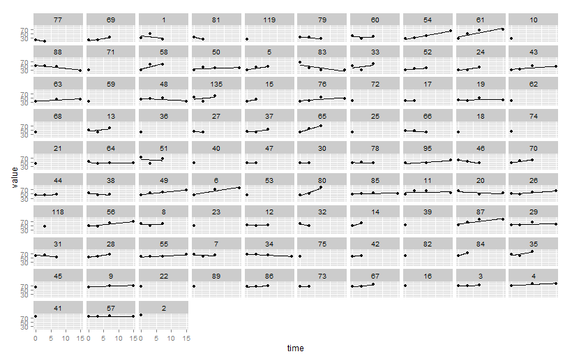
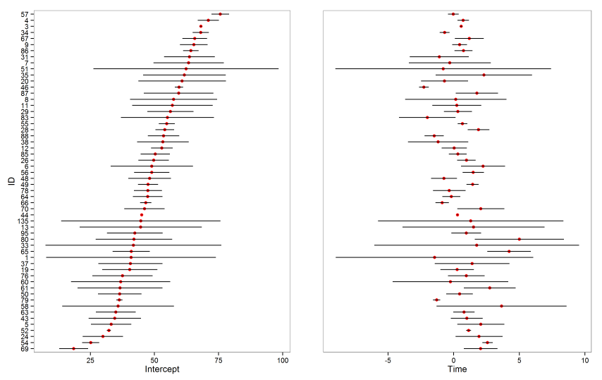
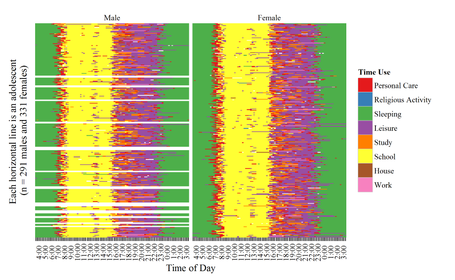

<br>
<br>
<center></center>
<br>
<br>

---

<br>
<br>
<center></center>
<br>
<br>

---

<br>
<br>
<center></center>
<br>
<br>

---

<br>
<br>
<center></center>
<br>
<br>

---

<br>
<br>
<center></center>
<br>
<br>

---

<br>
<br>
<center></center>
<br>
<br>

---

<br>
<br>
<center></center>
<br>
<br>

---

<br>
<br>
<center></center>
<br>
<br>

---

<br>
<br>
<center></center>
<br>
<br>

---

<br>
<br>
<center></center>
<br>
<br>

---

<br>
<br>
<center></center>
<br>
<br>

---

<br>
<br>
<center></center>
<br>
<br>

---

<br>
<br>
<center></center>
<br>
<br>

---

<br>
<br>
<center></center>
<br>
<br>

---

<br>
<br>
<center></center>
<br>
<br>

---

<br>
<br>
<center></center>
<br>
<br>

---

## ggplot2 works with dataframes

```{r data, echo = TRUE, include = TRUE, warning = FALSE, message = FALSE} 

   library(ggplot2)
   head(iris)
   
```  

---

## Object class matters

```{r class, echo = TRUE, warning = FALSE, message = FALSE} 

   lapply(iris, class)
   
```  

---

## Minimal example


```{r minimal code, echo = TRUE, warning = FALSE, message = FALSE, fig.show = 'hide'} 

   ggplot(iris, aes(x = Sepal.Width)) +
   geom_bar()  

```   


---


```{r first plot, echo = FALSE, warning = FALSE, message = FALSE, fig.width = 12, fig.height = 8, fig.align = 'center'} 

   ggplot(iris, aes(x = Sepal.Width)) +
   geom_bar()  
   
``` 

---

```{r as object 1, echo = TRUE, warning = FALSE, message = FALSE} 

   plot <- ggplot(iris, aes(x = Sepal.Width)) 
   plot <- plot + geom_bar()  

```   

---

```{r as object 2, echo = TRUE, warning = FALSE, message = FALSE, fig.align = 'center'} 

   plot

```   

---

## Data

```{r index data, echo = TRUE, warning = FALSE, message = FALSE, fig.width = 7, fig.height = 5, fig.align = 'center'} 

   ggplot(iris[1:10, ], aes(x = Sepal.Width)) +
   geom_bar()  

```   

---

```{r subset data, echo = TRUE, warning = FALSE, message = FALSE, fig.width = 7, fig.height = 5, fig.align = 'center'} 

   ggplot(subset(iris, Species == "setosa"), aes(x = Sepal.Width)) +
   geom_bar()  

``` 

---

```{r pipe data, echo = TRUE, warning = FALSE, message = FALSE, fig.width = 7, fig.height = 5, fig.align = 'center'} 

   library(dplyr)
   
   iris %>%
   filter(Species == "virginica") %>%

   ggplot(aes(x = Sepal.Width)) +
   geom_bar()  

``` 

---

## Class matters

```{r factor bar chart, echo = TRUE, warning = FALSE, message = FALSE, fig.width = 7, fig.height = 5, fig.align = 'center'} 

  iris %>%
  mutate(Sepal.Width = factor(round(Sepal.Width, 0))) %>%
  
  ggplot(aes(x = Sepal.Width)) +
  geom_bar() 

```

---


```{r numeric bar chart, echo = TRUE, warning = FALSE, message = FALSE, fig.width = 7, fig.height = 5, fig.align = 'center'} 

  iris %>%
  mutate(Sepal.Width = round(Sepal.Width, 0)) %>%
  
  ggplot(aes(x = Sepal.Width)) +
  geom_bar() 

```

---

## aes - Aesthetic Mapping

### x-axis
### y-axis
### color/fill
### shape/linetype
### size
### alpha

---


```{r iris x y, echo = TRUE, warning = FALSE, message = FALSE, fig.width = 8, fig.height = 6, fig.align = 'center'} 

 
  ggplot(iris, aes(x = Sepal.Width, y = Sepal.Length)) +
  geom_point() 

```

---


```{r iris color, echo = TRUE, warning = FALSE, message = FALSE, fig.width = 8, fig.height = 6, fig.align = 'center'} 

 
  ggplot(iris, aes(x = Sepal.Width, y = Sepal.Length, color = Species)) +
  geom_point() 

```

---

```{r iris size, echo = TRUE, warning = FALSE, message = FALSE, fig.width = 8, fig.height = 6, fig.align = 'center'} 

 
  ggplot(iris, aes(x = Sepal.Width, y = Sepal.Length, size = Species)) +
  geom_point() 

```

---

```{r iris shape, echo = TRUE, warning = FALSE, message = FALSE, fig.width = 8, fig.height = 6, fig.align = 'center'} 

 
  ggplot(iris, aes(x = Sepal.Width, y = Sepal.Length, shape = Species)) +
  geom_point() 

```

---

```{r iris max, echo = TRUE, warning = FALSE, message = FALSE, fig.width = 8, fig.height = 6, fig.align = 'center'} 

 
  ggplot(iris, aes(x = Sepal.Width, y = Sepal.Length, 
                   shape = Species, color = Sepal.Length, size = Sepal.Width)) +
  geom_point() 

```

---

```{r mpg max, echo = TRUE, warning = FALSE, message = FALSE, fig.width = 8, fig.height = 6, fig.align = 'center'} 

 
  ggplot(mpg, aes(x = cty, y = hwy, shape = drv, color = class, size = cyl)) +
  geom_point() 

```

