<br>
<br>
<center>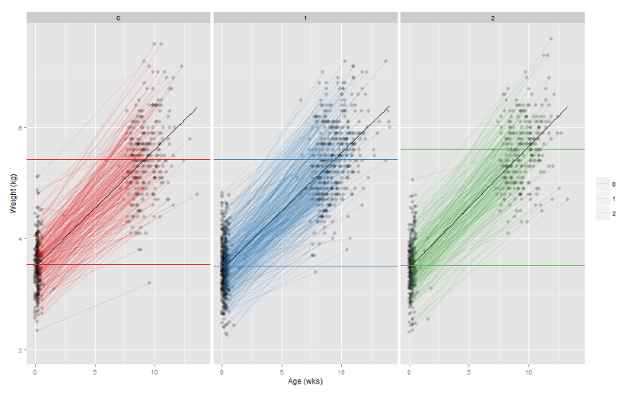</center>
<br>
<br>

---

<br>
<br>
<center>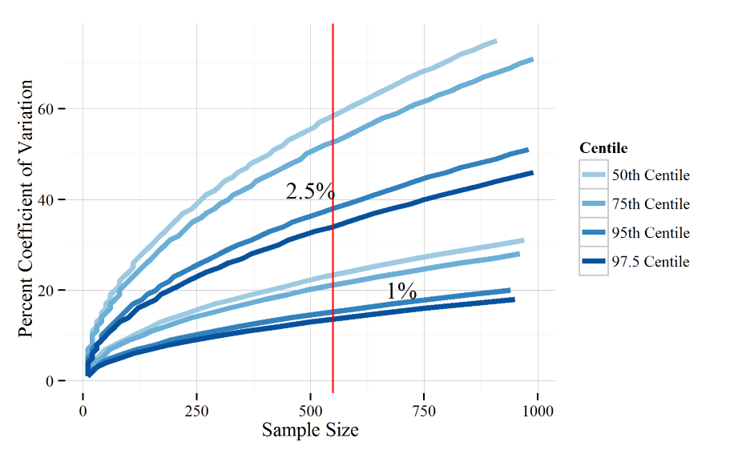</center>
<br>
<br>

---

<br>
<br>
<center>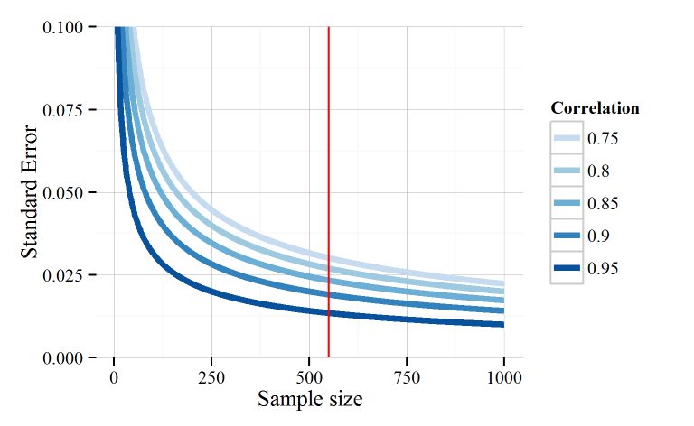</center>
<br>
<br>

---

<br>
<br>
<center>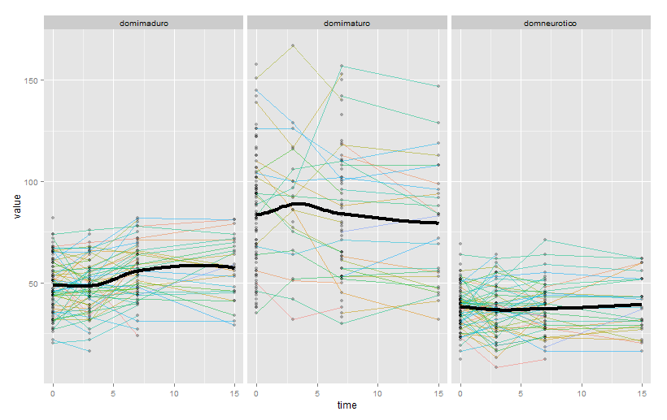</center>
<br>
<br>

---

<br>
<br>
<center>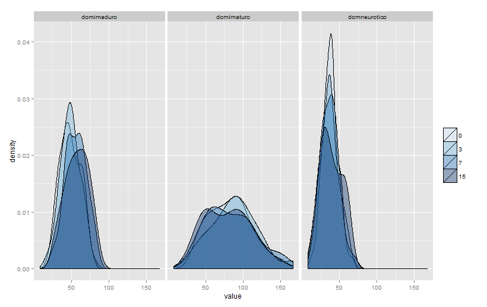</center>
<br>
<br>

---

<br>
<br>
<center>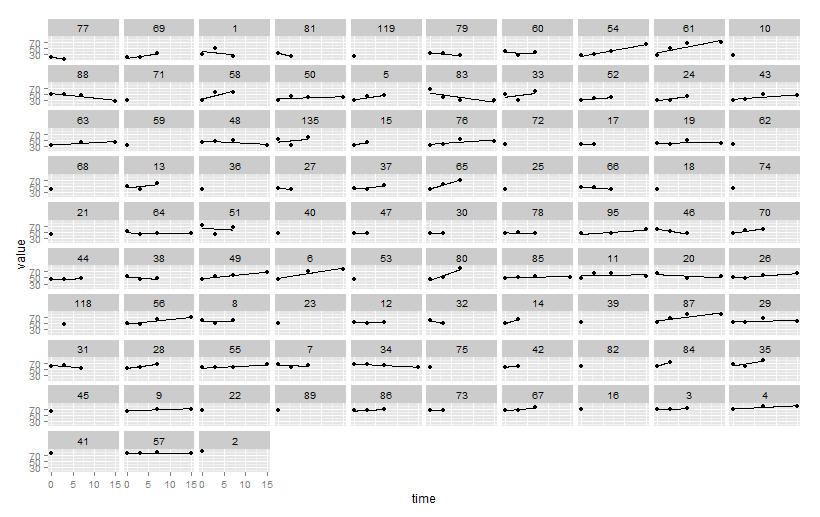</center>
<br>
<br>

---

<br>
<br>
<center>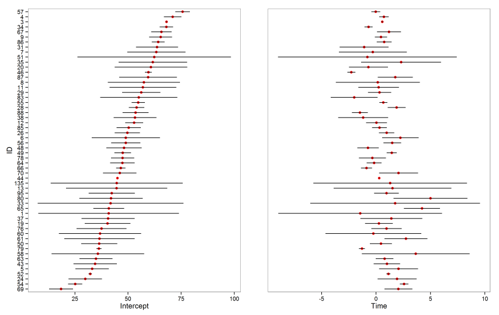</center>
<br>
<br>

---

<br>
<br>
<center>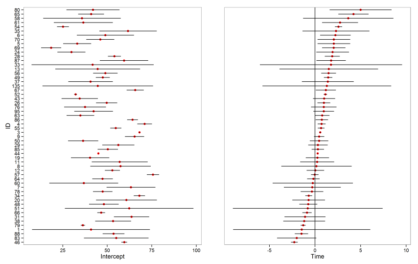</center>
<br>
<br>

---

<br>
<br>
<center>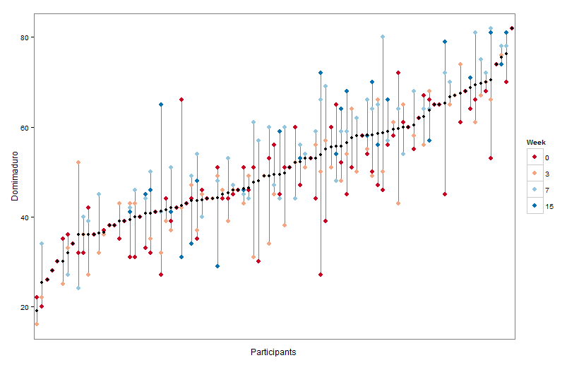</center>
<br>
<br>

---

<br>
<br>
<center>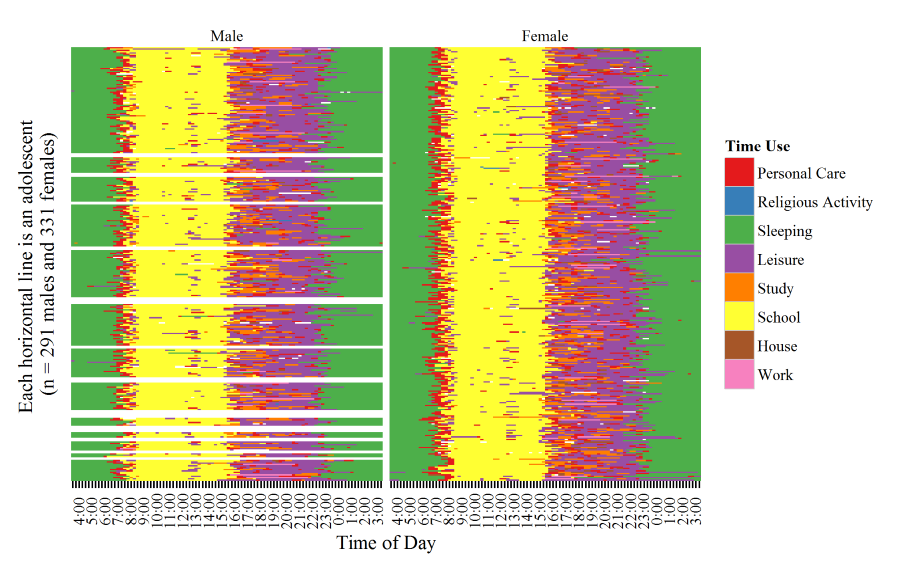</center>
<br>
<br>

---

<br>
<br>
<center>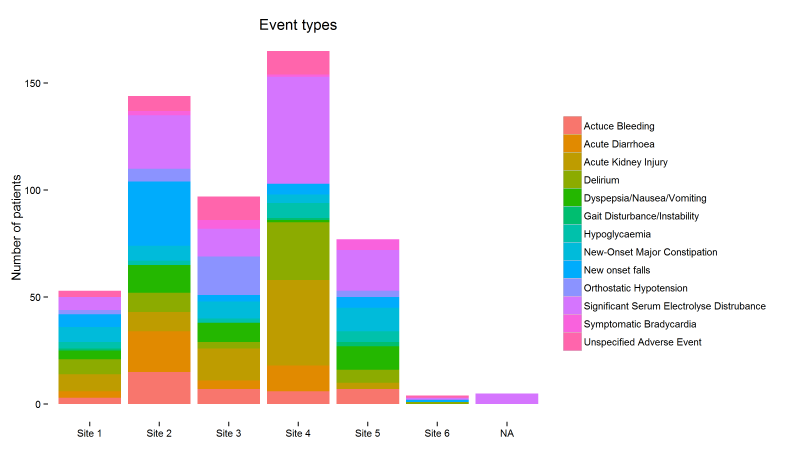</center>
<br>
<br>

---

<br>
<br>
<center>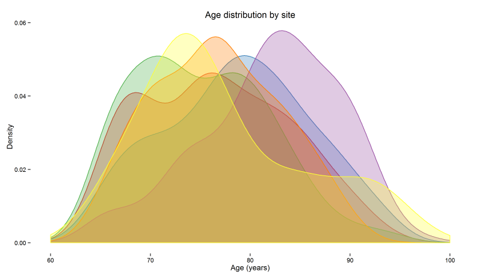</center>
<br>
<br>

---

<br>
<br>
<center>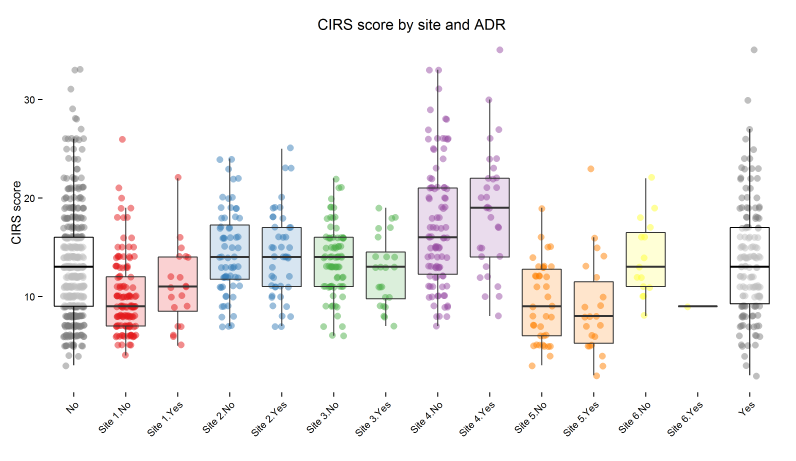</center>
<br>
<br>

---

<br>
<br>
<center>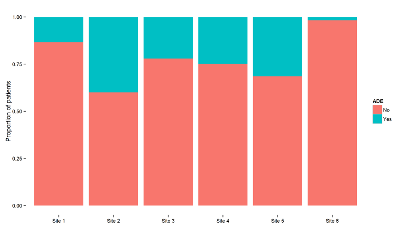</center>
<br>
<br>

---

<br>
<br>
<center>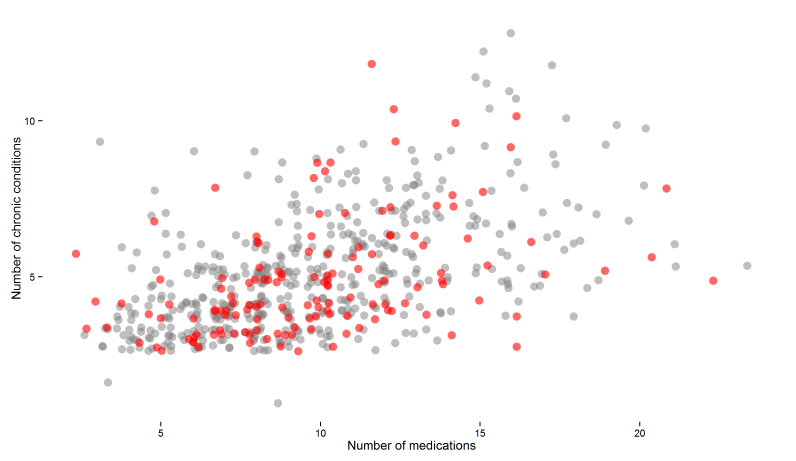</center>
<br>
<br>

---

<br>
<br>
<center>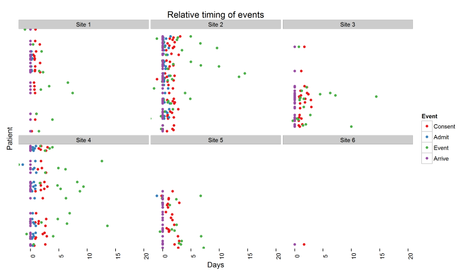</center>
<br>
<br>

---

## ggplot2 works with dataframes


```r
   library(ggplot2)
   head(iris)
```

```
##   Sepal.Length Sepal.Width Petal.Length Petal.Width Species
## 1          5.1         3.5          1.4         0.2  setosa
## 2          4.9         3.0          1.4         0.2  setosa
## 3          4.7         3.2          1.3         0.2  setosa
## 4          4.6         3.1          1.5         0.2  setosa
## 5          5.0         3.6          1.4         0.2  setosa
## 6          5.4         3.9          1.7         0.4  setosa
```

---

## Object class matters


```r
   lapply(iris, class)
```

```
## $Sepal.Length
## [1] "numeric"
## 
## $Sepal.Width
## [1] "numeric"
## 
## $Petal.Length
## [1] "numeric"
## 
## $Petal.Width
## [1] "numeric"
## 
## $Species
## [1] "factor"
```

---

## Minimal example


```r
   ggplot(iris, aes(x = Sepal.Width)) +
   geom_bar()  
```


---


---


```r
   plot <- ggplot(iris, aes(x = Sepal.Width)) 
   plot <- plot + geom_bar()  
```

---


```r
   plot
```


---

## Data


```r
   ggplot(iris[1:10, ], aes(x = Sepal.Width)) +
   geom_bar()  
```


---


```r
   ggplot(subset(iris, Species == "setosa"), aes(x = Sepal.Width)) +
   geom_bar()  
```


---


```r
   library(dplyr)
   
   iris %>%
   filter(Species == "virginica") %>%

   ggplot(aes(x = Sepal.Width)) +
   geom_bar()  
```


---

## Class matters


```r
  iris %>%
  mutate(Sepal.Width = factor(round(Sepal.Width, 0))) %>%
  
  ggplot(aes(x = Sepal.Width)) +
  geom_bar() 
```


---


```r
  iris %>%
  mutate(Sepal.Width = round(Sepal.Width, 0)) %>%
  
  ggplot(aes(x = Sepal.Width)) +
  geom_bar() 
```


---

## aes - Aesthetic Mapping

### x-axis
### y-axis
### color/fill
### shape/linetype
### size
### alpha

---


```r
  ggplot(iris, aes(x = Sepal.Width, y = Sepal.Length)) +
  geom_point() 
```


---


```r
  ggplot(iris, aes(x = Sepal.Width, y = Sepal.Length, color = Species)) +
  geom_point() 
```


---


```r
  ggplot(iris, aes(x = Sepal.Width, y = Sepal.Length, size = Species)) +
  geom_point() 
```


---


```r
  ggplot(iris, aes(x = Sepal.Width, y = Sepal.Length, shape = Species)) +
  geom_point() 
```


---


```r
  ggplot(iris, aes(x = Sepal.Width, y = Sepal.Length, 
                   shape = Species, color = Sepal.Length, size = Sepal.Width)) +
  geom_point() 
```


---


```r
  ggplot(mpg, aes(x = cty, y = hwy, shape = drv, color = class, size = cyl)) +
  geom_point() 
```


