<br>
<br>
<center></center>
<br>
<br>

---

<br>
<br>
<center></center>
<br>
<br>

---

<br>
<br>
<center></center>
<br>
<br>

---

<br>
<br>
<center></center>
<br>
<br>

---

<br>
<br>
<center></center>
<br>
<br>

---

<br>
<br>
<center></center>
<br>
<br>

---

<br>
<br>
<center></center>
<br>
<br>

---

<br>
<br>
<center></center>
<br>
<br>

---

<br>
<br>
<center></center>
<br>
<br>

---

<br>
<br>
<center></center>
<br>
<br>

---

<br>
<br>
<center></center>
<br>
<br>

---

<br>
<br>
<center></center>
<br>
<br>

---

<br>
<br>
<center></center>
<br>
<br>

---

## ggplot2 works with data frames


```r
   library(ggplot2)
   head(iris)
```

```
##   Sepal.Length Sepal.Width Petal.Length Petal.Width Species
## 1          5.1         3.5          1.4         0.2  setosa
## 2          4.9         3.0          1.4         0.2  setosa
## 3          4.7         3.2          1.3         0.2  setosa
## 4          4.6         3.1          1.5         0.2  setosa
## 5          5.0         3.6          1.4         0.2  setosa
## 6          5.4         3.9          1.7         0.4  setosa
```

---

## Object class matters


```r
   lapply(iris, class)
```

```
## $Sepal.Length
## [1] "numeric"
## 
## $Sepal.Width
## [1] "numeric"
## 
## $Petal.Length
## [1] "numeric"
## 
## $Petal.Width
## [1] "numeric"
## 
## $Species
## [1] "factor"
```

---

## Minimal example


```r
   ggplot(iris, aes(x = Sepal.Width)) +
   geom_bar()  
```


---


---


```r
   plot <- ggplot(iris, aes(x = Sepal.Width)) 
   plot <- plot + geom_bar()  
```

---


```r
   plot
```


---

## Data


```r
   ggplot(iris[1:10, ], aes(x = Sepal.Width)) +
   geom_bar()  
```


---


```r
   ggplot(subset(iris, Species == "setosa"), aes(x = Sepal.Width)) +
   geom_bar()  
```


---


```r
   library(dplyr)
   
   iris %>%
   filter(Species == "virginica") %>%

   ggplot(aes(x = Sepal.Width)) +
   geom_bar()  
```


---

## Class matters


```r
  iris %>%
  mutate(Sepal.Width = factor(round(Sepal.Width, 0))) %>%
  
  ggplot(aes(x = Sepal.Width)) +
  geom_bar() 
```


---


```r
  iris %>%
  mutate(Sepal.Width = round(Sepal.Width, 0)) %>%
  
  ggplot(aes(x = Sepal.Width)) +
  geom_bar() 
```


---

## aes - Aesthetic Mapping

### x-axis
### y-axis
### color/fill
### shape/linetype
### size
### alpha

### faceting

---


```r
  ggplot(iris, aes(x = Sepal.Width, y = Sepal.Length)) +
  geom_point() 
```


---


```r
  ggplot(iris, aes(x = Sepal.Width, y = Sepal.Length, color = Species)) +
  geom_point() 
```


---


```r
  ggplot(iris, aes(x = Sepal.Width, y = Sepal.Length, size = Species)) +
  geom_point() 
```


---


```r
  ggplot(iris, aes(x = Sepal.Width, y = Sepal.Length, shape = Species)) +
  geom_point() 
```


---


```r
  ggplot(iris, aes(x = Sepal.Width, y = Sepal.Length, 
                   shape = Species, color = Sepal.Length, size = Sepal.Width)) +
  geom_point() 
```


---


```r
  ggplot(mpg, aes(x = cty, y = hwy, shape = drv, color = class, size = cyl)) +
  geom_point() 
```


---


```r
  ggplot(mpg, aes(x = cty, y = hwy, shape = drv, color = class)) +
  geom_point() +
  facet_wrap(~cyl)
```

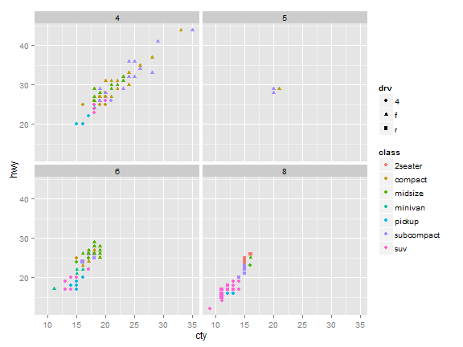

---

## Layers


```r
  ggplot(mpg, aes(x = cty, y = hwy, color = cyl)) +
  geom_point() 
```


---


```r
  ggplot(mpg, aes(x = cty, y = hwy, color = cyl)) +
  geom_point(color = "red") 
```

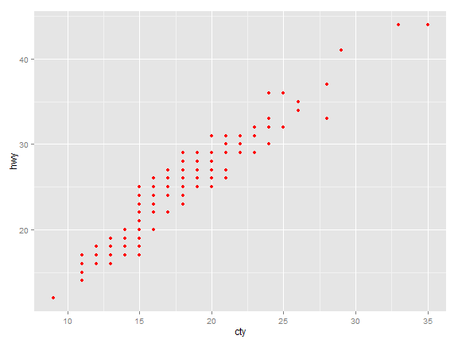

---


```r
  ggplot(mpg, aes(x = cty, y = hwy)) +
  geom_point(aes(color = cyl)) 
```

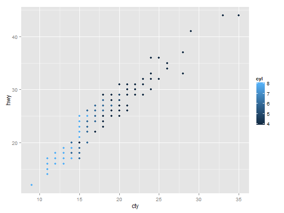

---


```r
  ggplot(mpg, aes(x = cty, y = hwy, color = cyl)) +
  geom_point() +
  geom_point(data = mpg[1:10, ], color = "red") 
```


---

## Geometries

<br>
<br>

<center>http://docs.ggplot2.org/current/</center>

---

## Scatter plots

---


```r
  ggplot(iris, aes(x = Sepal.Width, y = Sepal.Length)) +
  geom_point() 
```


---


```r
  ggplot(iris, aes(x = Sepal.Width, y = Sepal.Length)) +
  geom_jitter() 
```


---


```r
  ggplot(iris, aes(x = Sepal.Width, y = Sepal.Length)) +
  geom_jitter(size = 3.5, alpha = 0.5) 
```

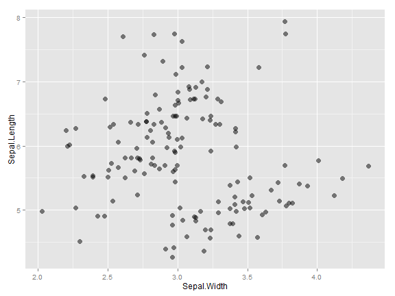

---


```r
  ggplot(iris, aes(x = Sepal.Width, y = Sepal.Length, color = Species)) +
  geom_jitter(size = 3.5, alpha = 0.5) 
```

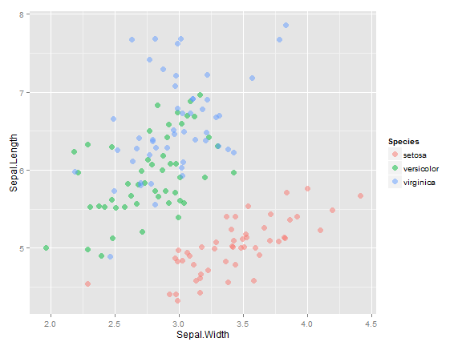

---


```r
  ggplot(iris, aes(x = Sepal.Width, y = Sepal.Length, color = Species)) +
  geom_jitter(size = 3.5, alpha = 0.5) +
  geom_smooth(method = "lm", se = FALSE)
```


---


```r
  ggplot(iris, aes(x = Sepal.Width, y = Sepal.Length, color = Species)) +
  geom_jitter(size = 3.5, alpha = 0.5) +
  geom_smooth(method = "lm", se = FALSE, color = "black")
```


---


```r
  ggplot(iris, aes(x = Sepal.Width, y = Sepal.Length, color = Species)) +
  geom_jitter(size = 3.5, alpha = 0.5) +
  geom_smooth(method = "lm", se = FALSE) +
  geom_smooth(method = "lm", se = FALSE, color = "black") 
```

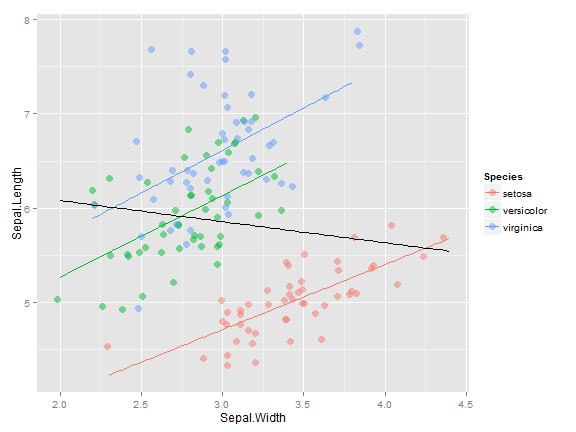

---


```r
  ggplot(mpg, aes(x = drv, y = class)) +
  geom_jitter(alpha = 0.5, position = position_jitter(width = 0.2, 
                                                      height = 0.2)) 
```

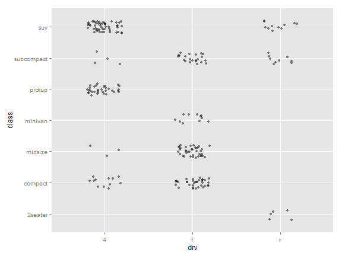

---


```r
  ggplot(mpg, aes(x = drv, y = class, color = year)) +
  geom_jitter(alpha = 0.5, position = position_jitter(width = 0.2, 
                                                      height = 0.2)) 
```

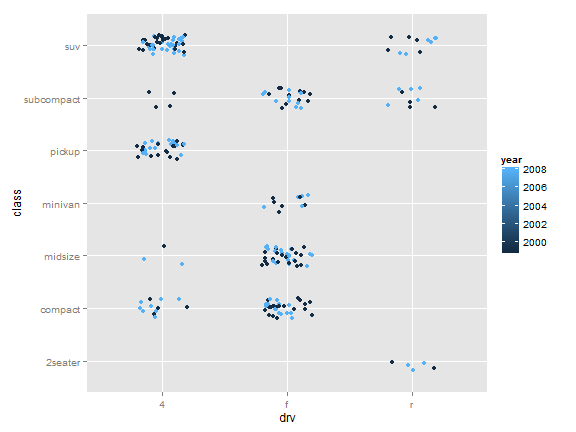

---


```r
  ggplot(mpg, aes(x = drv, y = class, color = factor(year))) +
  geom_jitter(alpha = 0.5, position = position_jitter(width = 0.2, 
                                                      height = 0.2)) 
```


---


## Boxplots

---


```r
  ggplot(iris, aes(x = Species, y = Sepal.Length)) +
  geom_boxplot() 
```


---


```r
  ggplot(iris, aes(x = Species, y = Sepal.Length)) +
  geom_jitter() +
  geom_boxplot() 
```

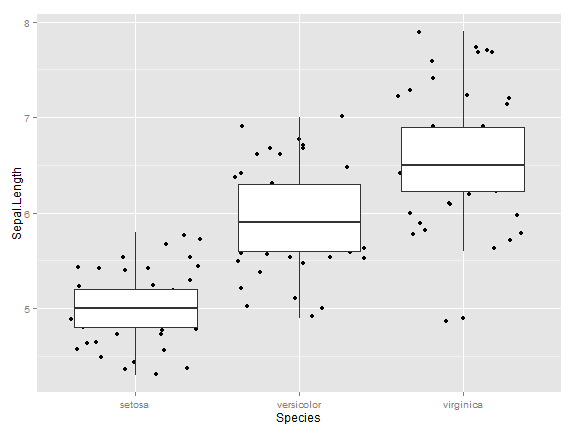

---


```r
  ggplot(iris, aes(x = Species, y = Sepal.Length)) +
  geom_jitter(position = position_jitter(width = 0.2, height = 0.1)) +
  geom_boxplot(alpha = 0.5) 
```

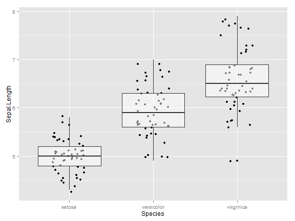

---


```r
  ggplot(iris, aes(x = Species, y = Sepal.Length, color = Species)) +
  geom_jitter(position = position_jitter(width = 0.2, height = 0.1), 
              outlier.shape = NA) +
  geom_boxplot(alpha = 0.5) 
```


---


```r
  ggplot(iris, aes(x = Species, y = Sepal.Length, color = Species, 
                   fill = Species)) +
  geom_jitter(position = position_jitter(width = 0.2, height = 0.1)) +
  geom_boxplot(alpha = 0.5, outlier.shape = NA) 
```


---


```r
  ggplot(iris, aes(x = Species, y = Sepal.Length, color = Species, 
                   fill = Species)) +
  geom_violin(alpha = 0.5) 
```


---

## Line plots

---


```r
  ggplot(economics, aes(x = date, y = pop)) +
  geom_line() 
```

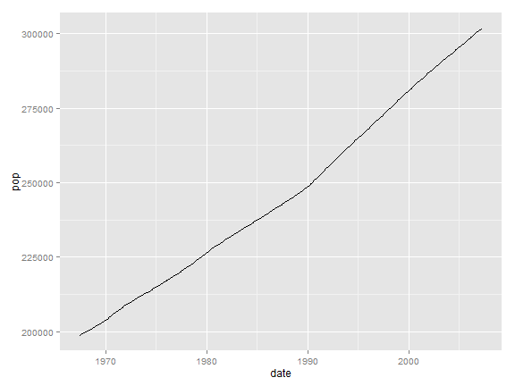

---


```r
  ggplot(Orange, aes(x = age, y = circumference)) +
  geom_line()
```

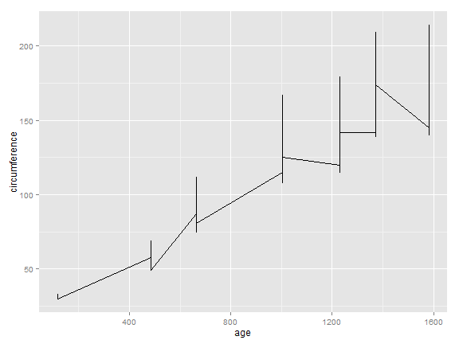

---


```r
  ggplot(Orange, aes(x = age, y = circumference, group = Tree)) +
  geom_line()
```

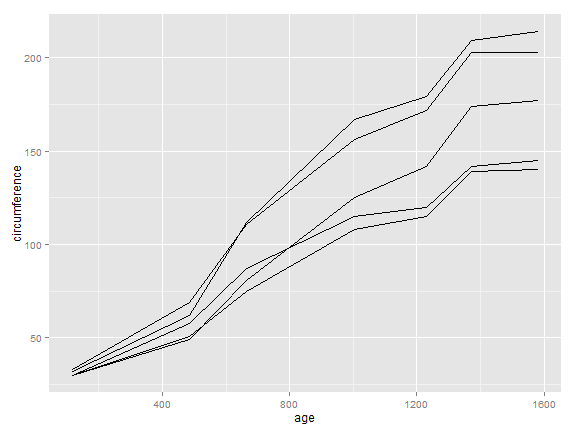

---


```r
  ggplot(Orange, aes(x = age, y = circumference, group = Tree, color = Tree)) +
  geom_line()
```


---


```r
  ggplot(Orange, aes(x = age, y = circumference, group = Tree, 
                     linetype = Tree, color = Tree)) +
  geom_line()
```


---


```r
  ggplot(Orange, aes(x = age, y = circumference, group = Tree, 
                     linetype = Tree, color = Tree)) +
  geom_point() +
  geom_smooth(method = "lm", se = FALSE)
```

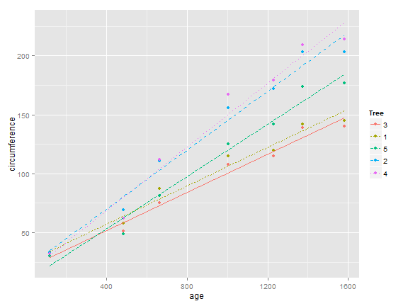

---


```r
  ggplot(Orange, aes(x = age, y = circumference, group = Tree, 
                     linetype = Tree, color = Tree)) +
  geom_point() +
  geom_smooth(se = FALSE)
```

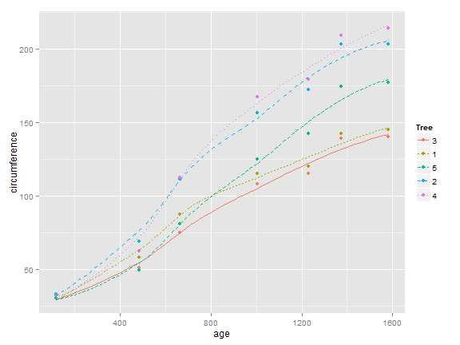

---

## Bar plots

---


```r
  ggplot(mpg, aes(x = factor(cyl))) +
  geom_bar()
```


---


```r
  ggplot(mpg, aes(x = factor(cyl))) +
  geom_bar() +
  coord_flip()
```

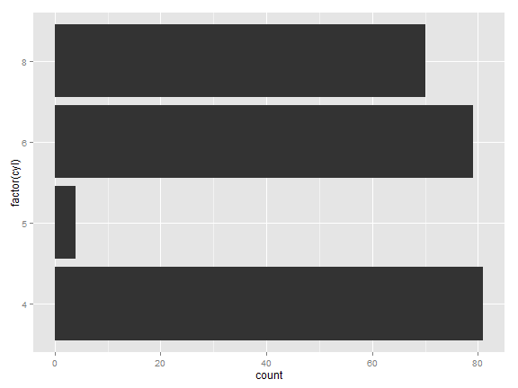

---


```r
  mpg %>%
  group_by(cyl) %>%
  summarize(total = n()) %>%
  mutate(cyl = factor(cyl)) %>%
  mutate(cyl = reorder(cyl, total, max)) 
```

```
## Source: local data frame [4 x 2]
## 
##   cyl total
## 1   4    81
## 2   5     4
## 3   6    79
## 4   8    70
```

---


```r
  mpg %>%
  group_by(cyl) %>%
  summarize(total = n()) %>%
  mutate(cyl = factor(cyl)) %>%
  mutate(cyl = reorder(cyl, total, max)) %>%
  
  ggplot(aes(x = cyl, y = total)) +
  geom_bar(stat = "identity") +
  coord_flip()
```

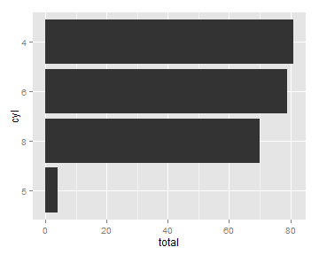

---


```r
  ggplot(mpg, aes(x = interaction(factor(cyl), class))) +
  geom_bar() +
  coord_flip()
```

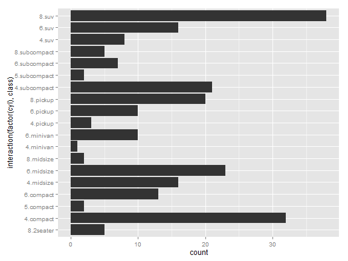

---


```r
  ggplot(mpg, aes(x = factor(cyl), fill = class)) +
  geom_bar()
```


---


```r
  ggplot(mpg, aes(x = factor(cyl), fill = class)) +
  geom_bar(position = "dodge")
```

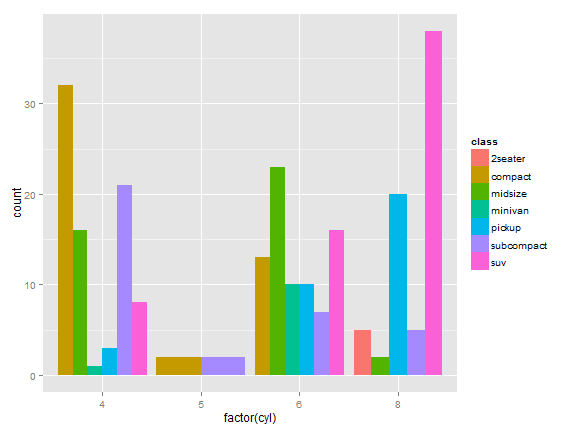

---


```r
  ggplot(mpg, aes(x = factor(cyl), y = cty)) +
  geom_bar(stat = "identity")
```


---


```r
  mpg %>%
  group_by(cyl) %>%
  summarize(meancty = mean(cty)) 
```

```
## Source: local data frame [4 x 2]
## 
##   cyl  meancty
## 1   4 21.01235
## 2   5 20.50000
## 3   6 16.21519
## 4   8 12.57143
```

---


```r
  mpg %>%
  group_by(cyl) %>%
  summarize(meancty = mean(cty)) %>%
   
  ggplot(aes(x = factor(cyl), y = meancty)) +
  geom_bar(stat = "identity")
```


